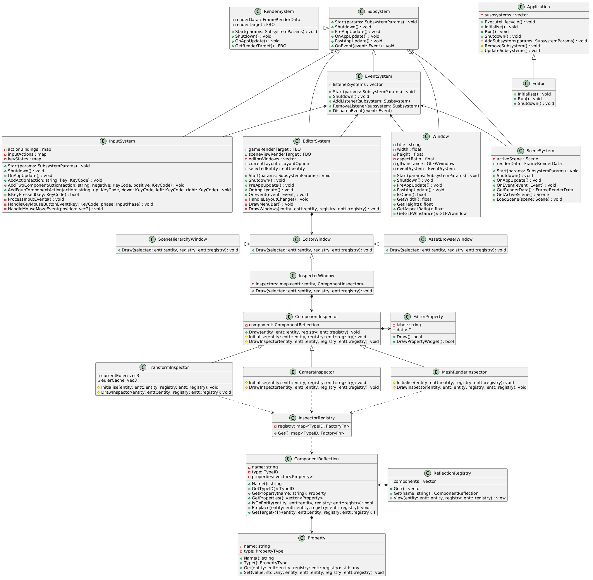
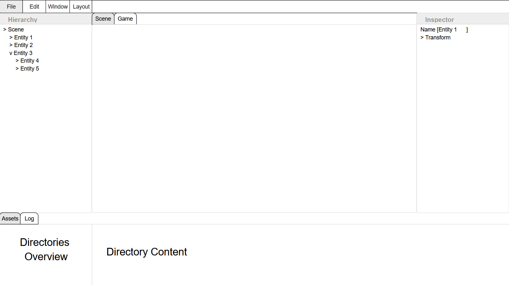

# **Solace Editor** 
*Technical Design Document*

# Contents
[Introduction](#1-introduction)\
&nbsp;&nbsp;&nbsp;&nbsp;[Purpose](#11-purpose)\
&nbsp;&nbsp;&nbsp;&nbsp;[Scope](#12-scope)\
&nbsp;&nbsp;&nbsp;&nbsp;[Non-Goals](#13-non-goals)\
[Architecture](#2-architecture)\
&nbsp;&nbsp;&nbsp;&nbsp;[Overview](#21-overview)\
&nbsp;&nbsp;&nbsp;&nbsp;[Relationship to Engine](#22-relationship-to-engine)\
&nbsp;&nbsp;&nbsp;&nbsp;[Execution Model](#23-execution-model)\
&nbsp;&nbsp;&nbsp;&nbsp;[Data Flow](#24-data-flow)\
[Engine ⇄ Editor Communication](#3-engine--editor-communication)\
&nbsp;&nbsp;&nbsp;&nbsp;[Communication Model](#31-communication-model)\
&nbsp;&nbsp;&nbsp;&nbsp;[Engine Interfaces](#32-engine-interfaces)\
[Editor Systems](#4-editor-systems)\
&nbsp;&nbsp;&nbsp;&nbsp;[Scene Editing](#41-scene-editing)\
&nbsp;&nbsp;&nbsp;&nbsp;[User Interface](#42-user-interface)\
[State Management](#5-state-management)\
&nbsp;&nbsp;&nbsp;&nbsp;[Undo and Redo](#51-undo-and-redo)\
&nbsp;&nbsp;&nbsp;&nbsp;[Dirty State Tracking](#52-dirty-state-tracking)\
[Serialisation](#6-serialisation)\
&nbsp;&nbsp;&nbsp;&nbsp;[File Format](#61-file-format)\
&nbsp;&nbsp;&nbsp;&nbsp;[Saving and Loading](#62-saving-and-loading)\
[Coding Standards](#7-coding-standards)\
&nbsp;&nbsp;&nbsp;&nbsp;[Classes and Structs](#71-classes-and-structs)\
&nbsp;&nbsp;&nbsp;&nbsp;[Variables](#72-variables)\
&nbsp;&nbsp;&nbsp;&nbsp;[Loops](#73-loops)\
&nbsp;&nbsp;&nbsp;&nbsp;[Conditionals](#74-conditionals)\
&nbsp;&nbsp;&nbsp;&nbsp;[Version Control](#75-version-control)

# 1 Introduction
The editor is a standalone application that consumes the engine as a library and operates directly on its active scene. Changes made in the editor are applied immediately, allowing users to see results in realtime, without an additional build step.
## 1.1 Purpose
The editor exists to reduce iteration time when developing scenes and gameplay data. It allows users to modify scene data and see results immediately. 
## 1.2 Scope
The editor allows users to create and modify scenes, inspect and edit component data, manage assets, and serialise and deserialise scene data. The editor also includes a scene viewport with interactive gizmos for transform manipulation.
## 1.3 Non-Goals
The editor is not intended for use within shipped applications and does not provide runtime gameplay functionality. It does not include content creation systems such as visual scripting, 3D modelling, or animation authoring. It also excludes systems to build and package standalone games.

# 2 Architecture
This section describes the high level structure of the editor, including its relationship to the engine, subsystem organisation, and execution model.
## 2.1 Overview

## 2.2 Relationship to Engine
The editor is a standalone application that links to the engine as a static library.

The engine provides an `Application` base class that the editor derives from, and a `CreateApplication` factory function used to instantiate the editor. 

The engine contains the application entry point, owning and controlling the application lifecycle:
```cpp
int main()
{
	Application* app = CreateApplication();
	app->ExecuteLifecycle();
	delete app;

	return 0;
}
```

The engine provides core runtime systems including event handling, window management, rendering, and ECS access. The editor configures and uses these systems but remains responsible for defining editor specific behaviour on top of them.

## 2.3 Execution Model
The engine defines a lifecycle of  `Initialise`, `Run`, and `Shutdown` functions, which are implemented by the editor application.

`Initialise` is used to configure and attach subsystems in a defined order. This order determines the update order used during the frame loop:
```cpp
void Editor::Initialise()
{
    // The editor adds the engine provided subsystems it requires
	AddSubsystem<EventSystem>();

	{
		WindowProps props;
		props.title = "Solace Editor";
		props.eventSystem = &EventSystem::Get();
		AddSubsystem<Window>(props);
	}

    {
		InputSystemProps props;
		props.eventSystem = &EventSystem::Get();
		AddSubsystem<InputSystem>(props);
	}

	{
		SceneSystemProps props;
		props.eventSystem = &EventSystem::Get();
		AddSubsystem<SceneSystem>(props);
	}

	{
		RenderSystemProps props;
		props.renderData = &SceneSystem::Get().GetRenderData();
		AddSubsystem<RenderSystem>(props);
	};	
	
    // This is an editor only subsystem, not provided by the engine
	{
		EditorSystemProps props;
		props.GLFWInstance = Window::Get().GetGLFWInstance();
		props.eventSystem = &EventSystem::Get();
		AddSubsystem<EditorSystem>(props);
	}
}
```

The engine invokes the editor’s `Run` method, which defines the main frame loop:
```cpp
void Editor::Run()
{
	while (Window::Get().IsOpen())
	{
		UpdateSubsystems();
	}
}
```
Each iteration of the loop represents a single frame. Subsystems are updated in the order they were added during initialisation, defining a deterministic execution pipeline.

`Shutdown` is then used to manually remove and safely shutdown each subsystem in the reverse order to initialisation:
```cpp
void Editor::Shutdown()
{
	RemoveSubsystem<EditorSystem>();
	RemoveSubsystem<RenderSystem>();
	RemoveSubsystem<SceneSystem>();
	RemoveSubsystem<Window>();
	RemoveSubsystem<EventSystem>();
}
```

# 3 Engine ⇄ Editor Communication
## 3.1 Communication Model
This section describes how the editor uses the reflection system to inspect and modify engine state. The editor is entirely schema-driven and does not depend on concrete component types.

### 3.1.1 Schema-Driven Workflow
The editor operates by iterating over runtime ECS state and resolving component metadata through the reflection system.

Typical editor inspection flow:

1. Enumerate active entities from the ECS registry
2. Resolve reflected components attached to each entity
3. Iterate over component metadata
4. Generate editor UI dynamically from reflected properties
4. Read or modify values through reflected property accessors

Example interaction flow:

```cpp
for (auto& entity : registry.view<entt::entity>())
{
    auto componentReflections =
        ReflectionRegistry::View(registry, entity);

    for (auto& component : componentReflections)
    {
        // Inspect reflected component metadata
        // Generate inspector UI
        // Access properties dynamically
    }
}
```
`ReflectionRegistry::View` acts as the bridge between ECS state and editor tooling by resolving only the reflected components present on a given entity.

All inspection and modification is performed through `ComponentReflection` and `Property` metadata resolved at runtime

### 3.1.2 Property Editing Flow
Component fields are accessed through the Property interface:

1. `Property::Get` retrieves a field value via `std::any`
2. `Property::Set` modifies a field value via `std::any`
3. Type conversion is handled at runtime

All inspector UI interactions are mediated through this layer.

Failure cases:

- Type mismatch between UI input and property type
- Invalid entity or destroyed component access
- Missing or unregistered property metadata

## 3.2 Engine Interfaces
The engine does not expose a wide set of component specific APIs to the editor. Instead, all editor interaction is handled through a reflection layer composed of `ReflectionRegistry`, `ComponentReflection`, and `Property`.

This creates a schema-driven boundary where the editor operates on metadata rather than concrete types.
### 3.2.1 Reflection Registry
`ReflectionRegistry` is the central catalogue of all component types known to the engine.

It is responsible for:

- Storing registered component reflections
- Providing lookup by name
- Exposing component metadata to external systems
- Generating filtered entity views based on component presence

It acts as the single entry point for type discovery.

### 3.2.2 Reflection Registration
Reflection metadata is registered through static initialisation during program startup.

Each component type registers:
- Component name
- `TypeID`
- Reflected properties
- Property accessors

Registration occurs before editor systems are initialised, ensuring the reflection registry is fully populated prior to inspection or modification operations.

This model removes the need for manual runtime registration but introduces dependency on static initialisation order.

`TypeID` is a deterministic hash of the component name, independent of registration order.

### 3.2.3 Component Reflection
`ComponentReflection` represents a single ECS component type in a type-erased form.

It defines both schema information and controlled interaction with ECS data:
- Component identity (`name`, `TypeID`)
- Property metadata describing fields
- Component presence queries (`IsOnEntity`)
- Component construction (`Emplace`)
- Type safe extraction (`GetTarget<T>`)

Each ComponentReflection acts as the engine’s description of  a component and how it can be accessed.
### 3.2.4 Property Reflection
`Property` represents a single field within a component.

It provides a uniform interface for field level access:
- Field identity (`name`, `type`)
- Runtime read access via `std::any`
- Runtime write access via `std::any`

Property is the lowest level unit of reflection.

### 3.2.5 Guarantees
- Component metadata must be fully registered before editor access
- `TypeID` must uniquely identify component types
- Property definitions must remain consistent across runtime sessions
- Entity references are invalidated on destruction
# 4 Editor Systems
This section describes the editor systems responsible for scene inspection, modification, and user interaction.

The editor is structured as a panel based application built around a reflection driven ECS workflow. Editor tools operate on runtime engine state through the communication model described in Section 3.
## 4.1 Scene Editing
The scene editing system provides runtime inspection and modification of ECS scene state.

Editor interactions are command driven and operate on reflected component metadata rather than concrete component types.

Supported editing operations include:
- Entity creation and destruction
- Entity selection and renaming
- Component addition and removal
- Runtime property editing
- Scene save and load operations

All scene modifications are routed through the editor command system to support undo and redo functionality.

The editor operates directly on live ECS state. Changes made through inspector controls are immediately reflected within the active scene.

### 4.1.1 Entity Selection
Entity selection is managed centrally by the editor context.

The currently selected entity is shared between:
- Scene Panel
- Inspector Panel
- Transform gizmos

Selection changes propagate immediately to all dependent editor systems.

Only one entity may be actively inspected at a time.

### 4.1.2 Component Editing
Component editing is performed through the reflection system.

The editor:
- Resolves reflected components attached to the selected entity
- Enumerates reflected properties
- Dynamically generates editor controls
- Applies modifications through reflected property accessors

No component specific editor code is needed for property editing.

## 4.2 User Interface
The editor interface is composed of independent dockable panels implemented using the immediate mode UI framework `imgui`.

Each panel is responsible for a specific aspect of scene inspection or modification.

Panels share access to:
- Active scene state
- Selected entity state
- Reflection metadata
- Editor command systems

The interface updates every frame and reflects live ECS state.



### 4.2.1 Menu Bar
The Menu Bar provides access to high-level editor operations and configuration workflows.

Operations are organised into four primary categories:

- File
  - Scene creation, loading, and saving
  - Project-level file operations
  - Editor shutdown
- Edit
  - Undo and redo operations
  - Clipboard-style entity operations
  - Editor action history interaction
- Window
  - Opening and closing editor panels
- Layout
  - Switching between predefined editor layouts
  - Resetting workspace arrangement
  - Persisting panel docking configurations

Menu actions either:
- dispatch editor commands
- modify shared editor state
- or invoke scene operations

The Menu Bar remains globally accessible regardless of active panel focus, providing a consistent entry point for editor-wide functionality.

### 4.2.2 Scene Panel
The Scene Panel presents the active ECS scene hierarchy and acts as the primary interface for entity selection and structural scene manipulation.

Entities are displayed using their `NameComponent` data and are resolved directly from the active registry context.

The panel supports:
- Entity selection
- Entity creation and deletion
- Hierarchical traversal
- Context-sensitive entity operations

Selection state is stored centrally within the editor context and propagated to dependent systems including:
- Inspector Panel
- Viewport gizmos
- Editor command handlers

Scene hierarchy updates occur immediately in response to ECS changes, ensuring the panel always reflects live runtime state.

### 4.2.3 Inspector Panel
The Inspector Panel provides reflection driven inspection and modification of components attached to the currently selected entity.

During editor initialisation, inspectors are constructed for reflected component types and associated with entities through a cached lookup structure. This cache maps entity identifiers to the inspectors responsible for rendering their attached components.

When selection changes:
1. The selected entity is resolved from the editor selection context
2. The corresponding inspector set is retrieved from the entity-inspector cache
3. Cached inspectors render and modify component data

This avoids rebuilding inspector structures during normal editor interaction and reduces repeated reflection traversal at runtime.

Inspector implementations interact with ECS data through reflected `Property` accessors, allowing component editing without direct compile-time dependency on component layouts.

Property modification is performed through:
- `Property::Get`
- `Property::Set`

Unsupported or unregistered component types are omitted from inspector generation.

### 4.2.3 Asset Browser
The Asset Browser provides project asset navigation and asset reference management.

Assets are displayed using the active project directory structure and are resolved directly from filesystem paths.

The panel supports:
- Directory traversal
- Asset discovery and filtering
- Drag-and-drop asset assignment
- Asset preview rendering

Drag and drop workflows allow assets to be assigned directly to reflected component properties within the Inspector Panel.

The Asset Browser updates dynamically in response to filesystem changes and project asset imports.

# 5 State Management

## 5.1 Undo and Redo
The editor uses a command-based undo and redo system to support reversible scene modifications.

Each editor action that mutates persistent scene state is represented as a command object containing:
- Target entity information
- Operation metadata
- Previous state data
- Updated state data

Supported reversible operations include:
- Entity creation and deletion
- Component addition and removal
- Property modification
- Entity renaming

Commands are pushed onto an undo stack after execution. Undo operations revert the most recent command and move it to the redo stack. Executing a new command clears the redo history.

Property modifications are captured through reflected Property accessors, allowing generic undo support without component-specific implementations.

## 5.2 Dirty State Tracking
The editor tracks unsaved scene modifications through a dirty state system.

A scene is marked dirty whenever persistent ECS state is modified, including:
- Entity creation or deletion
- Component addition or removal
- Property value modification
- Hierarchy changes

Transient editor operations such as:
- Entity selection
- Viewport navigation
- Panel visibility changes

do not affect dirty state.

Dirty flags are cleared when a scene is successfully saved or reloaded.

The dirty state system is used to:
- Indicate unsaved modifications in the editor UI
- Prevent accidental data loss
- Control scene save prompts during shutdown or scene switching

# 6 Serialisation
This section describes the scene serialisation system used to persist and reconstruct ECS scene state.

Scene data is stored in a reflection-driven JSON format. Components and properties are serialised dynamically through the reflection system rather than through component-specific serialisation code.

The serialiser operates directly on ECS registry state and reconstructs entities and components during scene loading.

## 6.1 File Format
Scenes are stored using a hierarchical JSON structure composed of:
- Scene metadata
- Entity definitions
- Reflected component data
- Reflected property values

Each scene file contains:
- A scene name
- An array of serialised entities

Each entity contains:
- A `Name`
- Zero or more reflected components

Each component contains:
- Reflected property entries

Each property stores:
- Property type information
- Serialised property value data

Example structure:
```json
{
    "Scene": "Default Scene",
    "Entities": [
        {
            "Name": "Cube",
            "Transform": {
                "Position": {
                    "Type": "vec3",
                    "Value": [1.0, 2.0, -4.0]
                }
            }
        }
    ]
}
```
Property values are serialised according to PropertyType.

Supported property types currently include:
- `bool`
- `int`
- `float`
- `vec2`
- `vec3`
- `vec4`
- `quaternion`
- `string`

Vector and quaternion values are stored as ordered numeric arrays.

The file format is reflection-driven and does not require component-specific scene serialisation logic. New reflected component types become serialisable automatically provided their properties expose supported `PropertyType` values.

## 6.2 Saving and Loading
Scene serialisation is performed by `SceneSerialiser`.

During saving:
1. The active scene name is written
2. All entities are enumerated from the ECS registry
3. Reflected components are resolved through `ReflectionRegistry::View`
4. Component properties are serialised dynamically through reflected property accessors
5. The resulting JSON document is written to disk

Property values are retrieved through:
- `Property::Get`
- Runtime `std::any` extraction
- Property-type-specific JSON conversion

Directory structures are created automatically if they do not already exist.

During loading:
1. The current registry state is cleared
2. Scene JSON is parsed from disk
3. Entities are recreated
4. Components are reconstructed through `ComponentReflection::Emplace`
5. Property values are restored through `Property::Set`

Component reconstruction is fully reflection-driven and does not require hardcoded deserialisation logic for individual component types.

Special case handling is currently used for scene state such as assignment of the main camera entity.

Failure cases include:
- Invalid or malformed JSON data
- Missing reflected component registrations
- Unsupported property types
- Type mismatches during `std::any` conversion
- Missing filesystem paths or inaccessible files

The serialisation system currently prioritises simplicity and editor integration over versioning or backwards compatibility. Scene files are expected to match the runtime reflection schema used by the executing engine version.

# 7 Coding Standards
## 7.1 Classes and Structs
Classes and structs should be named using `PascalCase`.

`class` types should generally be used for objects that contain behaviour and manage their own state.

`struct` types should generally be used as simple data containers with little or no behavioural logic. This is typically used for ECS components, configuration data, and parameter structures.
## 7.2 Variables
Local variables and function parameters should use `camelCase`.

Private member variables should use the `m_camelCase` convention.

Public member variables should use `PascalCase`, but public mutable state in classes should be avoided where possible. In most cases, access should instead be provided through member functions such as `Get` and `Set`.

Public data members are acceptable in structs where direct access is intentional.
## 7.3 Loops
Range-based for loops should generally be preferred where indexed access is not required:
```cpp
for (const auto& subsystem : m_Subsystems)
{
	subsystem->Update();
}
```

Indexed loops should generally only be used where positional access is required:
```cpp
for (size_t i = 0; i < vertices.size(); ++i)
{
	ProcessVertex(vertices[i]);
}
```
Loops should avoid unnecessary copies and remain simple and readable.
## 7.4 Conditionals
Conditional logic should remain simple and readable. 

Conditionals should evaluate boolean expressions directly:
```cpp
if (condition)
{
}
```
rather than:
```cpp
if (condition == true)
{
}
```

Complex conditions should be broken into intermediate variables where appropriate:
```cpp
bool entitySelected = selectedEntity != entt::null;
bool transformEditable = !m_IsPlaying && !m_TransformLocked;

if (entitySelected && transformEditable && m_ViewportFocused)
{
	DrawGizmos();
}
```
instead of:
```cpp
if (selectedEntity != entt::null && !m_IsPlaying &&	!m_TransformLocked && m_ViewportFocused)
{
	DrawGizmos();
}
```

Early returns should be preferred where they reduce nesting:
```cpp
if (!condition)
{
	return;
}

Foo();
```

Braces should always be used for conditional bodies, including single-line statements:
```cpp
if (condition)
{
	Foo();
}
```
## 7.5 Version Control
### 7.5.1 Branching
New features and fixes should generally be developed on separate branches. Branch names should clearly describe the purpose of the work being carried out.

Branches should remain focused on a single feature, fix, or related set of changes to reduce unnecessary merge conflicts and keep commit history readable.

Feature branches should be kept reasonably up to date with the main branch during development, and merged into the main branch using standard merge commits once the work is complete and tested.

#### Prefixes
**`feature/`**\
Used for new functionality or editor features.\
*Example:* `feature/editor-viewport`

**`bugfix/`**\
Used for non-critical fixes and general issue resolution.\
*Example:* `bugfix/component-not-serialising`

**`release/`**\
Used for release preparation and version stabilisation.\
*Example:* `release/v1.0`

**`hotfix/`**\
Used for urgent fixes to released versions.\
*Example:* `hotfix/crash-on-startup`

**`docs/`**\
Used for documentation changes such as updating existing documentation or adding new documentation.\
*Example:* `docs/add-wiki-section`

### 7.5.2 Commits
Commits should be made frequently and kept small in scope, focusing on a single logical change at a time. This makes the history easier to review, simplifies debugging, and reduces the risk of large, difficult-to-merge changes accumulating over time.

#### Prefixes
**`feat:`**\
Used for new features or functionality.\
*Example:* `feat: Add entity selection`

**`fix:`**\
Used for bug fixes and issue resolution.\
*Example:* `fix: Prevent crash on scene load`

**`core:`**\
Used for foundational systems, architecture, or engine-level changes.\
Example: `core: Add subsystem base class`

**`perf:`**\
Used for optimisation and performance improvements.\
*Example:* `perf: Reduce render allocations`

**`ui:`**\
Used for editor UI and tooling changes.\
*Example:* `ui: Add inspector panel`

**`test:`**\
Used for tests and test infrastructure.\
*Example:* `test: Add serialisation tests`

**`docs:`**\
Used for documentation changes and updates.\
*Example:* `docs: Update README`

**`chore:`**\
Used for maintenance, cleanup, and non-functional changes.\
*Example:* `chore: Reorganise asset folders`

